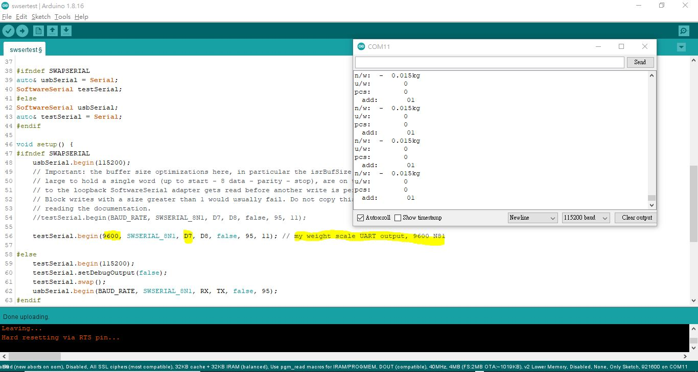

# ESP8266_SoftwareSerial_testing
no fork, https://github.com/plerup/espsoftwareserial


clone the source code for testing only,  

### hardware  

ESP8266, Wemos D1, Pin D7 used as software RX, weight scale UART output 5V, connection via 220 ohm resistor,  

### software tweaking,
```
    //testSerial.begin(BAUD_RATE, SWSERIAL_8N1, D7, D8, false, 95, 11);
    
    testSerial.begin(9600, SWSERIAL_8N1, D7, D8, false, 95, 11); // my weight scale UART output, 9600 N81
```


  
